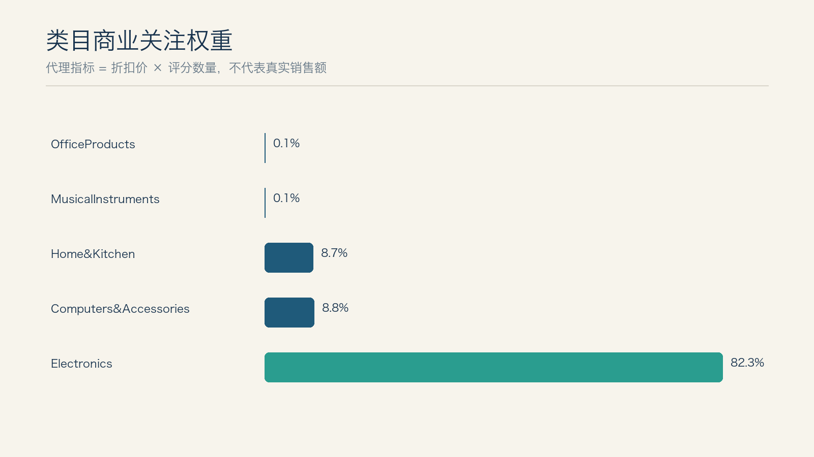
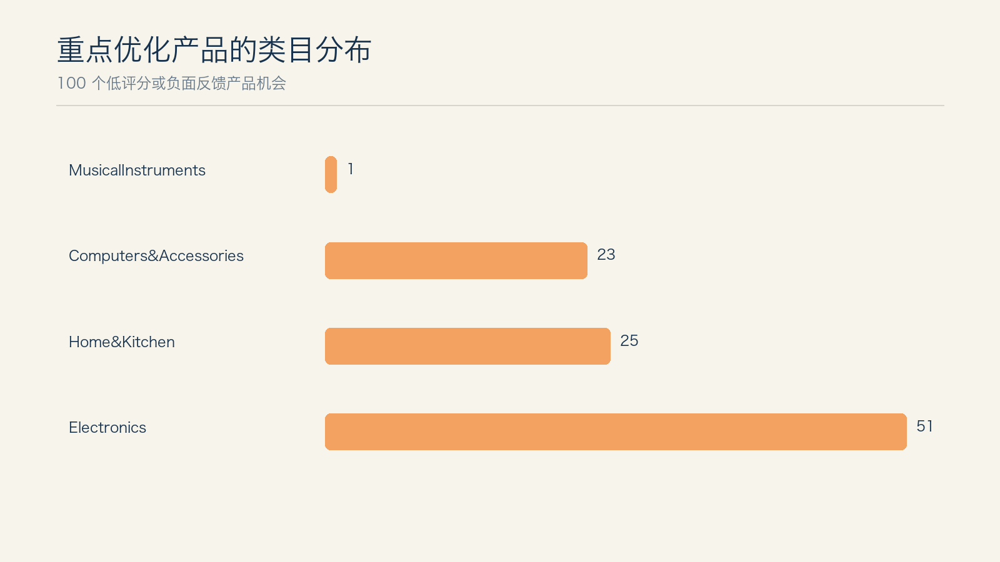
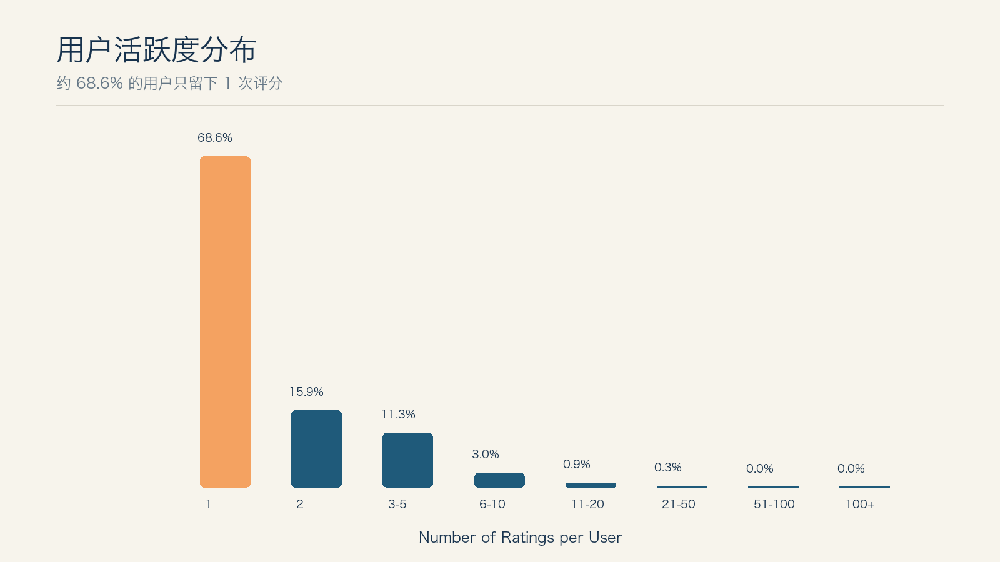
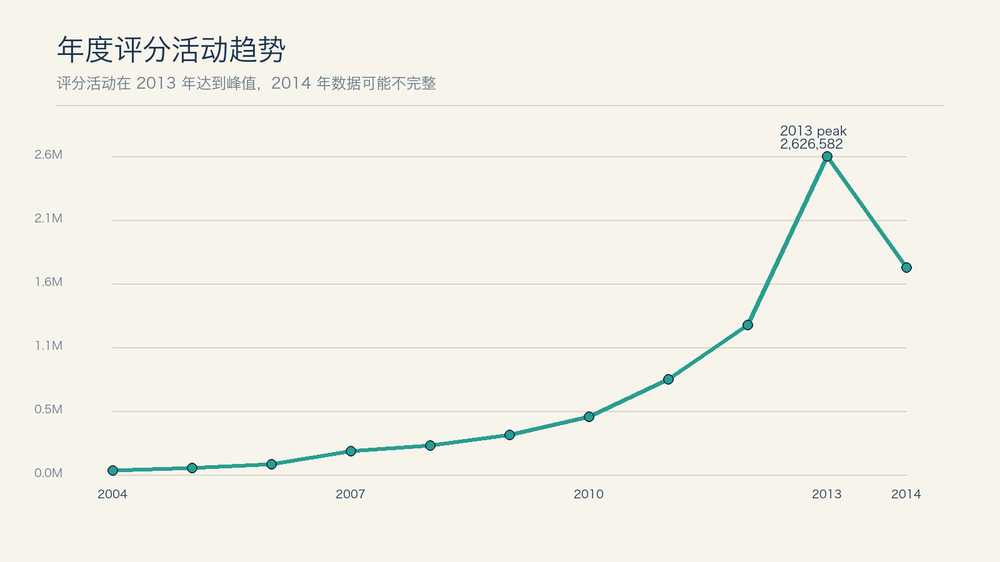
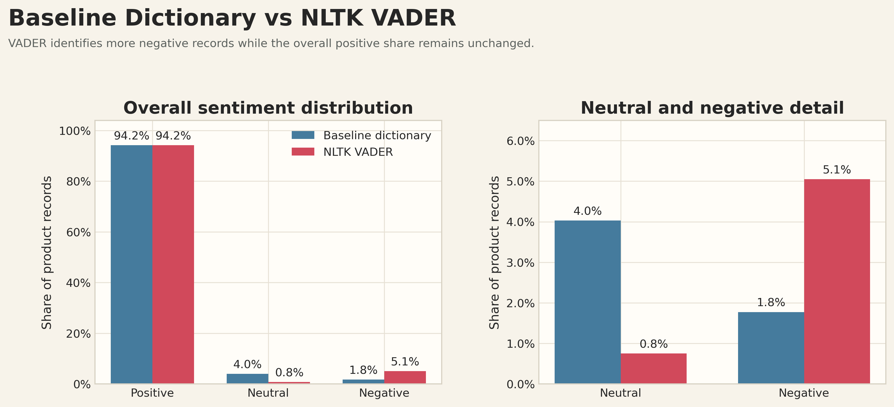
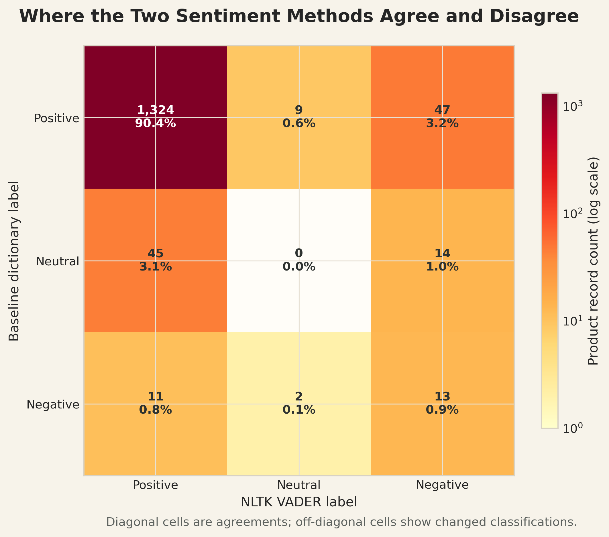
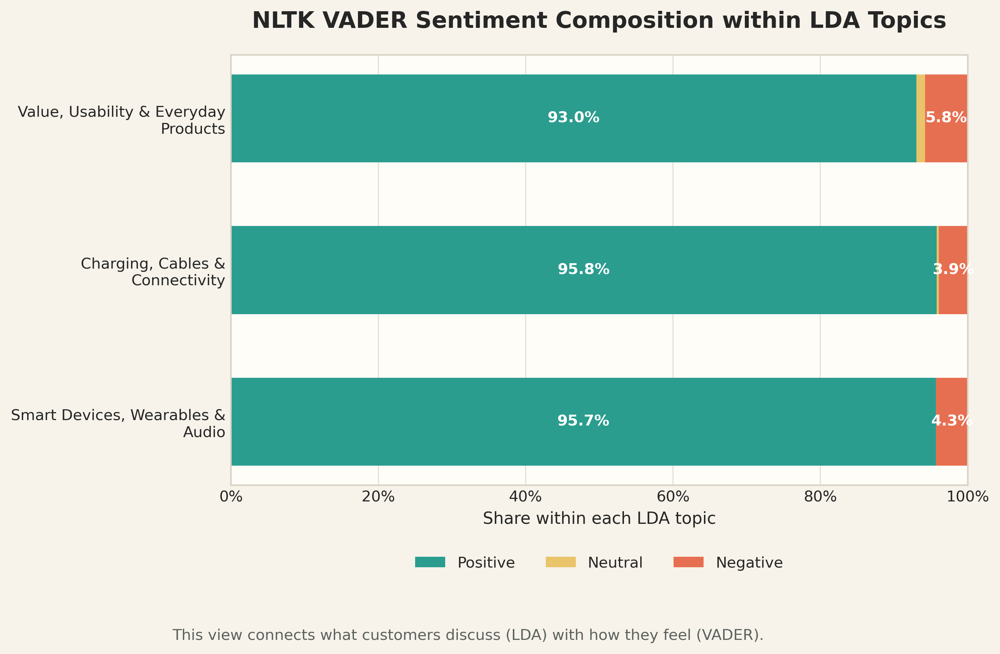
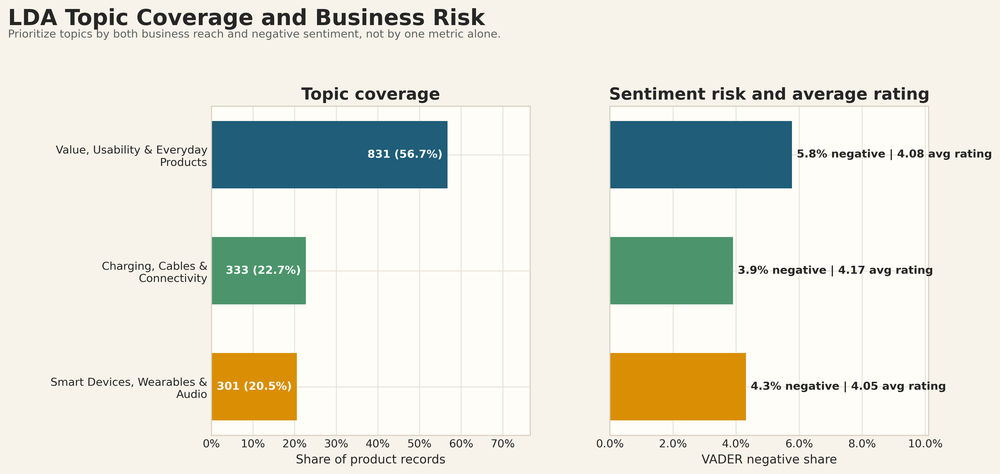
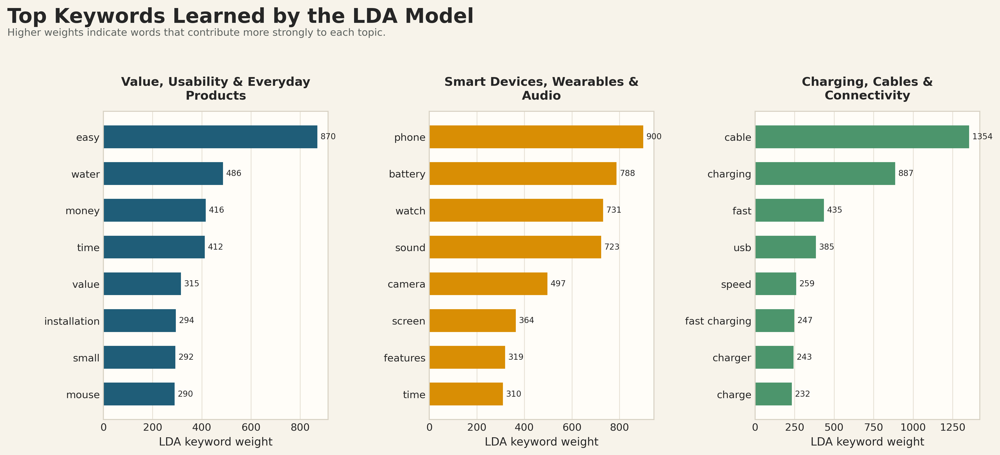
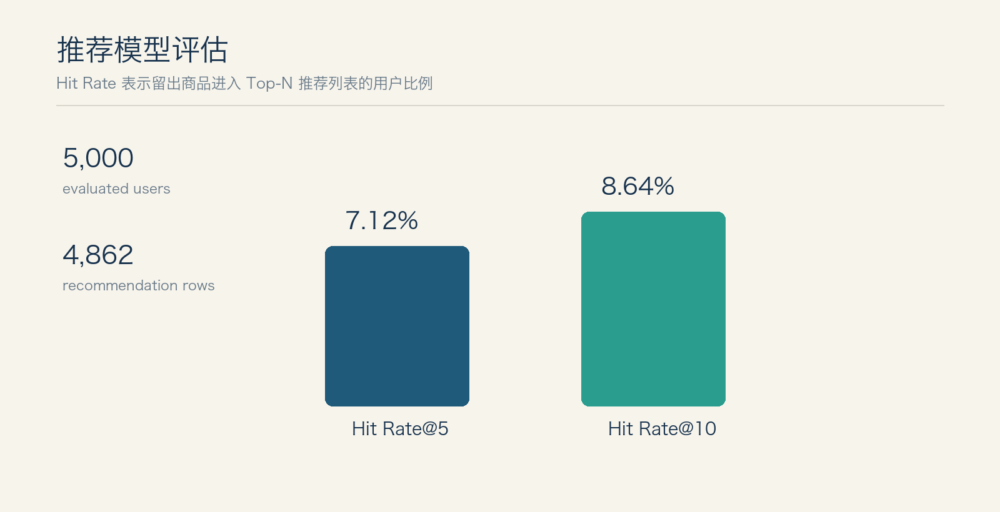

# Amazon 电商商业数据分析项目最终报告

## 执行摘要

本项目使用两份 Amazon 数据完成了从数据清洗、业务指标定义、探索性分析、Tableau 可视化，到 NLTK 情感分析、LDA 主题模型和推荐系统原型的端到端分析流程。

产品侧样本显示，Electronics 占估算商业关注权重的 82.3%，并占 100 个重点优化产品中的 51 个，是当前样本中应优先投入质量排查和运营资源的类目。需要强调，该权重由“折扣价 × 评分数量”计算，只能表示商业关注优先级，不是真实销售额。

用户侧数据显示，68.6% 的用户只留下过一次评分，评分矩阵高度稀疏。高活跃用户群的五星评分占比为 59.0%，高于普通用户的 55.1%；但数据没有订单金额，因此只能称为高活跃用户，不能称为真实高价值用户。

评论侧中，NLTK VADER 将 74 条产品记录识别为负向，高于词典 baseline 的 26 条，两种方法的一致率为 91.26%。LDA 最终选择三个主题，其中“Value, Usability & Everyday Products”覆盖 56.72% 的产品记录，负向占比也最高，为 5.78%；“Smart Devices, Wearables & Audio”的平均评分最低，为 4.053。

推荐原型生成 4,862 条商品推荐关系，在 5,000 名用户上取得 Hit Rate@5 7.12% 和 Hit Rate@10 8.64%。它可以作为候选商品召回层，但尚不能直接替代生产级推荐系统。

## 一、业务问题与数据回答边界

本项目希望回答四类问题：哪些类目和产品值得优先投入资源、用户行为呈现什么模式、评论中最重要的关注点是什么，以及是否可以构建推荐原型。

为防止过度解释，所有结论分为三个层级：

| 结论层级 | 可以回答的内容 | 不能被替代解释的内容 |
|---|---|---|
| 直接指标 | 产品数、评分数、平均评分、用户评分次数、情感标签、主题概率 | 不代表订单、利润或库存 |
| 代理指标 | 折扣价 × 评分数量形成的商业关注权重 | 不是真实销售额或 GMV |
| 当前无法回答 | 类目真实增长率、高价值用户消费额、转化率、复购率、库存预测 | 需要订单、金额、曝光、点击和库存数据 |

`amazon.csv` 包含 1,465 条产品记录和 1,351 个唯一产品，用于产品、价格、类目和评论分析。`ratings_Electronics.csv` 包含 7,824,482 条评分行为、4,201,696 个唯一用户和 476,002 个唯一商品，用于用户行为、年度趋势和推荐模型。

两个数据集只有 6 个商品 ID 能够精确重合，因为它们来自不同时间、地区和商品池。因此本项目没有强行拼接两张表，也不会声称已经识别出“高活跃用户具体评论了哪些 LDA 主题”。

## 二、分析流程

第一周建立数据基础：完成字段理解、缺失和异常检查、价格与评分字段数值化、Unix 时间转换、类目拆分以及两个数据集的关联可行性检查。

第二周完成业务探索：分析类目表现、评分分布、年度评分趋势、用户活跃度、评论长度、高频词和初步情感，并为 Tableau 输出分析表。

第三周完成模型原型：先建立可解释的词典情感和关键词主题 baseline，再补充 NLTK VADER、正式 sklearn LDA，以及 item-item 共现推荐模型。

第四周完成综合商业分析：把前三周结果整合为业务问题、证据、限制和可执行建议，并整理最终报告、GitHub 结构和演示材料。

## 三、产品类目与商业关注度

Electronics 占估算商业关注权重的 82.3%，Computers&Accessories 和 Home&Kitchen 分别占 8.8% 和 8.7%。这一集中度说明当前样本中的商业关注和产品风险主要集中在电子类商品，但不能据此声称 Electronics 的真实销售额占 82.3%。

从产品风险看，Electronics 有 31 个“高代理权重且低评分”产品，Home&Kitchen 有 13 个，Computers&Accessories 有 5 个。进一步筛选出的 100 个低评分或负面反馈机会中，Electronics 占 51 个，Home&Kitchen 占 25 个，Computers&Accessories 占 23 个。

### 关键问题：哪些类目增长最快但差评较多？

当前数据不能计算类目增长速度。评分行为表没有类目字段，而它与产品表只有 6 个商品重合，因此无法把年度评分趋势可靠地拆分到产品类目。

可以回答的替代问题是“哪些类目同时具有较高商业关注权重和较多风险产品”。答案是 Electronics，应作为第一优先级；Home&Kitchen 的平均评分为 4.041，且包含 25 个重点优化机会，应作为第二优先级；Computers&Accessories 整体平均评分为 4.155，但其 23 个重点机会产品的平均评分只有 3.691，说明风险集中在部分商品，而不是整个类目。

## 四、用户行为与时间趋势

用户行为呈现明显长尾：68.6% 的用户只评分一次，15.9% 评分两次，11.3% 评分 3 至 5 次。只有极少数用户产生大量评分，这也是推荐矩阵稀疏、共现关系有限的重要原因。

评分活动在 2013 年达到 2,626,582 条。2014 年记录下降到 1,708,604 条，但数据很可能没有覆盖完整年度，因此不能把下降直接解释为业务衰退。

高活跃用户群产生的评分中，五星占 59.0%，一星占 6.0%；普通用户群中五星占 55.1%，一星占 12.2%。这说明高活跃用户在该数据集中整体更偏正向，但它不等于他们消费金额更高。

### 关键问题：高价值用户关注什么，如何用于营销？

当前数据不能直接回答“高价值用户关注什么”。一方面没有订单金额，无法定义真实高价值用户；另一方面评分行为表与评论文本表不能可靠关联，无法把高活跃用户连接到 LDA 主题。

可以采取的营销替代方案是：把高活跃用户作为高互动人群，邀请其参与新品试用、评论激励和早期反馈；同时使用全体产品评论中提取的 LDA 主题指导营销内容。两者可以分别使用，但在获得统一用户与订单数据前不能声称已经验证了“高活跃用户最关注某个主题”。

## 五、评论情感与 LDA 主题

词典 baseline 和 NLTK VADER 都识别出 1,380 条正向记录，但 baseline 识别出 59 条中性和 26 条负向记录，VADER 则识别出 11 条中性和 74 条负向记录。VADER 对负面表达更敏感，因此更适合作为风险筛选补充，但不能被视为绝对正确标签。

LDA 比较了 3 至 8 个主题，最终选择验证集困惑度最低的三主题模型。三个主题分别为：

| LDA 主题 | 产品记录 | 占比 | 平均评分 | VADER 负向占比 |
|---|---:|---:|---:|---:|
| Value, Usability & Everyday Products | 831 | 56.72% | 4.083 | 5.78% |
| Smart Devices, Wearables & Audio | 301 | 20.55% | 4.053 | 4.32% |
| Charging, Cables & Connectivity | 333 | 22.73% | 4.171 | 3.90% |

“Value, Usability & Everyday Products”覆盖范围最大且负向比例最高，应优先检查安装难度、使用说明、性价比感知和日常体验。“Smart Devices, Wearables & Audio”平均评分最低，应重点关注续航、屏幕、声音、蓝牙连接和功能稳定性。“Charging, Cables & Connectivity”整体评分最高，但仍应清楚展示接口、功率、充电速度和兼容设备。

## 六、推荐系统原型

推荐系统选择评分次数为 2 至 20 次的用户作为候选，并抽样 50,000 名用户。过滤后使用 96,018 条交互构建 item-item 共现相似度，为 2,102 个源商品生成 4,862 条推荐关系。

在 5,000 名用户上的留出评估中，Hit Rate@5 为 7.12%，Hit Rate@10 为 8.64%。增加推荐列表长度带来 1.52 个百分点的命中率提升，但绝对效果仍然有限。

该模型适合充当候选商品召回层。生产环境中应增加流行度 fallback、商品属性相似度和用户近期行为，并使用 surprise KNN 或矩阵分解模型进行对比，同时增加 Precision@K、Recall@K、覆盖率和多样性指标。

## 七、综合商业建议

### 7.1 产品与供应链

建立“商业关注权重 + 评分 + VADER 情感 + LDA 主题概率”的产品风险清单。优先排查 Electronics，再检查 Home&Kitchen 和 Computers&Accessories 的重点机会商品。对高反馈低评分商品执行抽检、故障原因归类、供应商复盘和退换货原因追踪。

供应链层面的结论应表述为“需要优先排查”，而不是“已经证明供应链导致差评”，因为当前数据没有供应商、物流时效和退货原因字段。

### 7.2 商品页面与产品改进

针对易用性和日常体验主题，优化安装步骤、尺寸、使用场景和售后说明；针对智能设备与音频主题，重点说明续航、屏幕、声音和蓝牙兼容性；针对充电与线缆主题，统一展示接口、功率、充电协议和适配设备。

### 7.3 精准营销

将高活跃用户用于评论邀请、新品试用和用户共创，而不是直接当作高消费人群。营销内容可按 LDA 主题设计：强调易用性与性价比、突出智能设备功能体验、清楚解释充电速度与兼容性。后续接入订单数据后，再按真实消费金额、购买频率和品类偏好建立 RFM 或 CLV 分群。

### 7.4 推荐策略

保留 item-item 共现模型作为 baseline 和候选召回层，加入热门商品兜底，并在有更多用户行为后采用协同过滤和混合排序。上线前通过 A/B 测试比较点击率、加购率、转化率和推荐覆盖率。

### 7.5 库存预测

当前不能生成可靠库存预测，因为缺少订单日期、销量、库存、补货、缺货和促销数据。现阶段只能用商业关注权重和评分热度确定“需要监控的商品”，不能把它们作为需求预测值。

后续应按 SKU 和日期采集销量、库存、价格、促销、退货和交付周期，再建立移动平均、指数平滑或时间序列模型，并使用 MAE、RMSE 和缺货率评估。

## 八、实施路线图

0–30 天：上线重点产品风险清单；对 Electronics 的 51 个机会产品开展页面、质量和售后排查；统一充电、兼容性和安装说明。

31–60 天：建立 VADER 负向评论监控和主题趋势看板；邀请高活跃用户参与新品反馈；对推荐 baseline 增加热门商品兜底和商品属性召回。

61–90 天：接入订单、曝光、点击、加购、退货和库存数据；建立真实用户价值分群、类目增长分析、推荐 A/B 测试和库存预测。

## 九、结论

本项目最重要的价值不是把所有数据强行合并，而是在数据边界内建立可信的分析链路。现有证据支持优先关注 Electronics 和三类评论体验问题，也支持将高活跃用户用于互动运营、将 item-item 模型用于推荐候选召回。

现有证据不支持声称某类目增长最快、不支持计算高价值用户消费额，也不支持直接给出库存预测。把这些限制明确写入报告，可以让后续数据建设和商业决策更加可靠。
